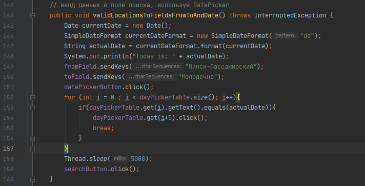
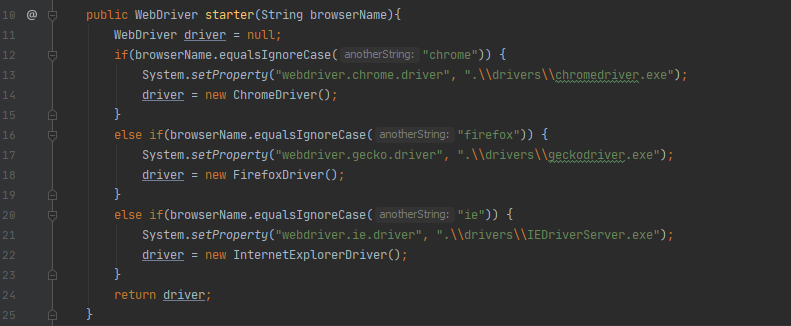

### [MainPageRW](/src/main/java/rwPages/MainPageRW.java) class has a new version of *validLocationsToFieldsFromToAndDate()* method. ###

 
 

**Old one:**

 
Here we enter the whole date using keyboard.

 
 
   
 
 
 
  
  
 
 **New one:**
 
  
 Here we use the functionality of so called datepicker.
 
 
 
  
 
 
 
 ### [BasicTest](/src/test/java/tests/BasicTest.java) class was added. It stores the driver configuration method. ###

  
 
 
 