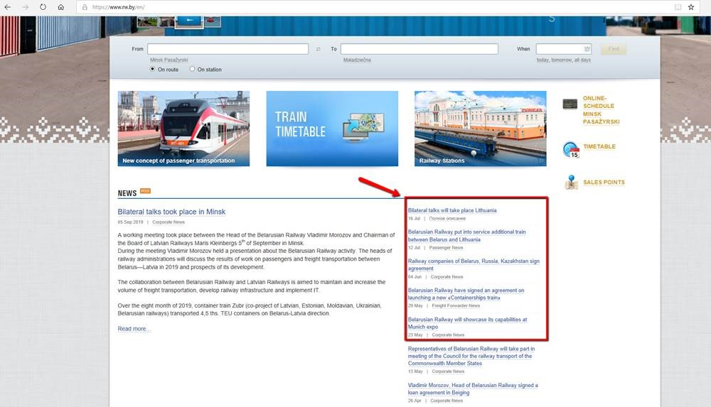

***
Create automated tests that perform for this site:*** 

[rw.by](rw.by)

 

*Automate following scenarios:*

1. Opening site from google

    - Open google.com
    - Type in the input for search “белорусская железная дорога”
    - Click on “Google Search” button
    - From the search results, click link that corresponds to the target URL (https://www.rw.by/)
    - Check that main page of site was loaded fine

2. Work with main page

    - Open site
    - Switch to the English language
    - Check, that not less than 4 news are displayed into the “News” section:
    
     
    
    
    
     
    
    - Check, that text “© 2019 Belarusian Railway” is displayed in the bottom of the page
    - Check, that 5 buttons are present in the top part of the page: “Press Center”, “Timetable”, “Passenger Services”, “Freight”, “Corporate”
3. Work with search
    - Open site
    - Type in “Поиск” input 20 random symbols (they should be different for each execution).
    - Check, that address in browser changed to the https://www.rw.by/search/?s=Y&q=<your text>
    - Check, that text “К сожалению, на ваш поисковый запрос ничего не найдено.” is displayed on a page
    - Clear entered on step b value from the corresponding input, and enter “Санкт-Петербург” instead.
    - Click “Найти”
    - Check, that 15 links to the articles are displayed on a screen
    - Write into the console text from that links
4. Work with calendar
    - Open site
    - Type in “Откуда” and “Куда” some valid locations’ names
    - Click on calendar button, and select date == 5 days from today. 
    
      
    
    1. Date should be selected even in case it is last day of the month – e.g. in case you are running your test on 29th of September, it should select 4th of October, etc.
        1. Click on “Найти”
        2. Write to the console departure time and trains name, use format:
        3. “Минск-Пассажирский — Брест-Центральный” – 19:25
    2. “Витебск-Пассажирский — Брест-Центральный” – 23:06
        1. Click on the first link
        2. Check that name of train is displayed on a page.
        3. Check that text under the text “Дни курсирования” is not empty
        4. Return to the main page of site by clicking on the site’s logo
        5. Check that main page loaded fine.
___
               
О выборе языка и тулов – он за вами, есть пару вариантов:

 

 +	Java + Test NG + Maven
 +	C# + Nunit
 +	JS (WebDriver IO)
 
 
     
Вне зависимости от выбранного языка, нужно реализовать работу с сайтом средствами Selenium WebDriver.

 

Плюсом при оценке итоговой версии работы будет использование паттерна Page Object и поддержка возможности запуска тестов в трёх браузерах – IE, Firefox, Chrome.

 
        
Итог работы должен быть выложен в ваш репозиторий в Git LAB или GitHub
         
       
